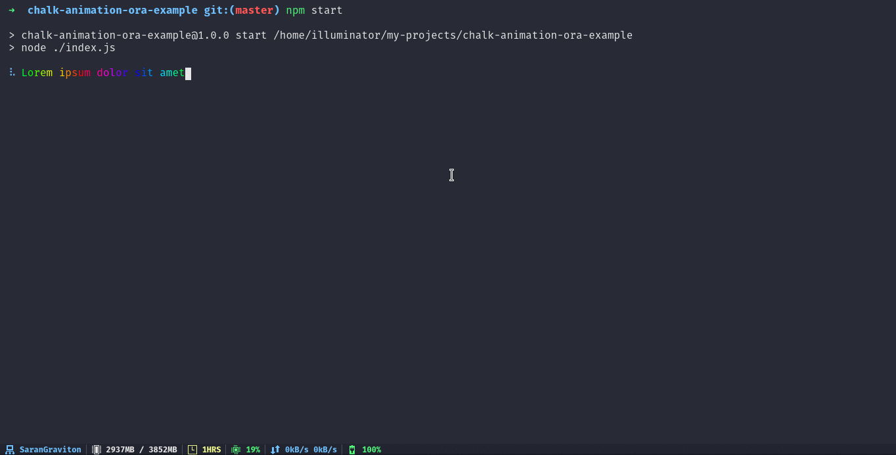

# Chalk Animation + Ora Example

An example for using [**ora**](https://github.com/sindresorhus/ora) with [**chalk-animation**](https://github.com/bokub/chalk-animation).

> Solution by [@bokub](https://github.com/bokub) in [bokub/chalk-animation#5](https://github.com/bokub/chalk-animation/issues/5).

## Get started

```bash
# install
npm install
# run
npm start
```

## 😎


